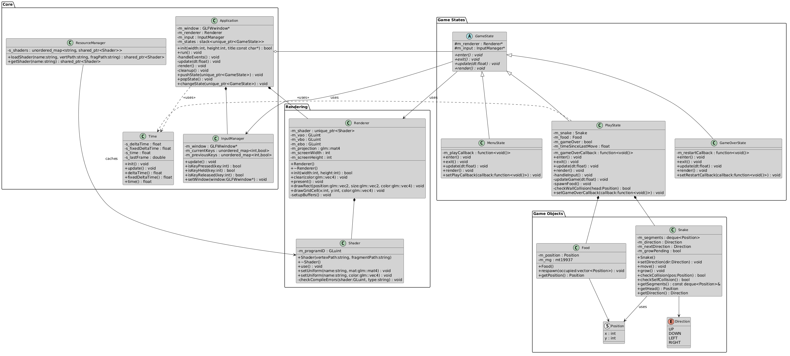

# OpenGL Snake Game

A classic Snake game written in C++ from scratch using modern OpenGL (version 3.3 Core Profile), GLFW, and GLAD. This project is meant to showcase basic game engine architecture, state management, and 2D rendering using a custom shader pipeline.

## Features
- **Modern OpenGL Rendering:** custom Vertex & Fragment shaders (GLSL), VAO/VBO abstractions.
- **Game Loop Architecture:** Delta times, fixed timesteps, and decoupled rendering from logic updates. 
- **Singleton Managers:** Centralized management for generic operations like `InputManager`, `Time`, and `ResourceManager`.
- **Snake Mechanics:** Standard game rules (growing, self-collision, wall-collision, queued inputs to prevent rapid-fire crashing).

---

## 🏛️ Class Architecture

To better understand how the decoupled engine layers interact with the specific Game Logic, here is an overview of the system architecture:



---

## 🚀 Building & Running

### Prerequisites
- A C++17 compatible compiler (MSVC, GCC, Clang)
- CMake (version 3.10+)
- **No external installations required:** All necessary third-party libraries (GLFW, GLM, GLAD) are included directly in the `third_party` directory.

### Build Instructions (CMake)
1. **Configure the Project:**
   Open a terminal in the root of the project and run:
   ```bash
   cmake -B build
   ```
2. **Compile:**
   ```bash
   cmake --build build --config Debug
   ```
3. **Run:**
   Execute the built binary. CMake has automatically been configured to copy shaders alongside the executable:
   ```bash
   ./build/Debug/SnakeGame.exe
   ```

## 🎮 Controls
* **Arrow Keys**: Change direction.
* **P**: Pause / Unpause the game.
* **R**: Restart the game at any time.
* **ESC**: Quit the application. 
